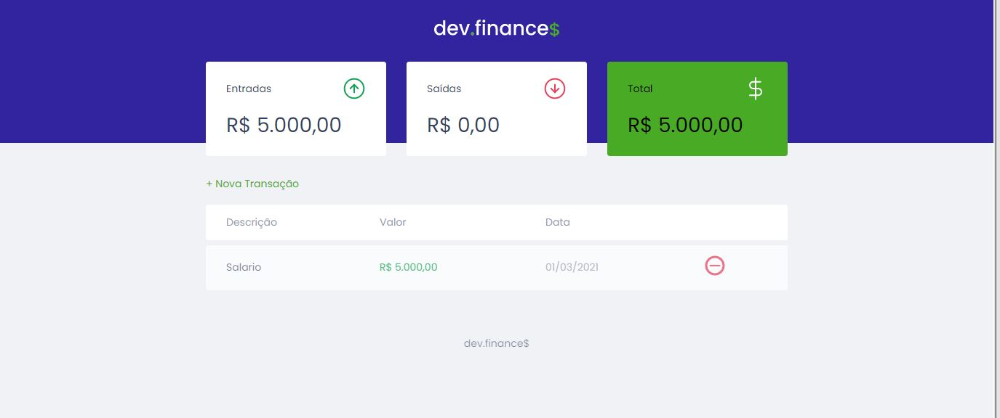

    

 

## 💻 Projeto

O dev.finance é uma aplicação de controle financeiro, onde é possível cadastrar e excluir transações, além de visualizar o saldo das entradas e saídas realizadas. 💰

O projeto foi desenvolvido durante a maratona discover da Rocketseat.

## 🚀 Tecnologias

Esse projeto foi desenvolvido com as seguintes tecnologias:

- HTML
- CSS
- JavaScript

